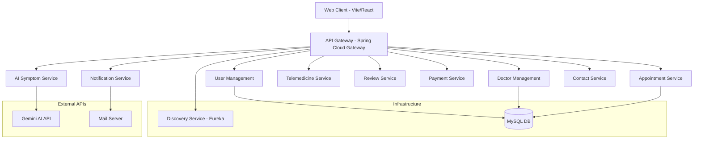

# AI-Powered Hospital Management System

A state-of-the-art, microservices-based Hospital Management System (HMS) featuring AI-driven symptom analysis, real-time doctor management, and seamless patient care integration.


---

## 🌟 Key Features

-   **🤖 AI Symptom Analyzer**: Integrated Gemini AI for preliminary symptom assessment and advice.
-   **👨‍⚕️ Doctor Management**: Real-time management of doctor specializations, availability, and profiles.
-   **📅 Appointment Scheduling**: Seamless booking and tracking of patient appointments.
-   **🎥 Telemedicine**: Integrated virtual consultation capabilities.
-   **👤 User Management**: Secure authentication and role-based access control.
-   **💳 Payment Integration**: Automated billing and payment processing.
-   **📧 Notifications**: Automated email and SMS alerts for appointments and updates.
-   **💬 Patient Reviews**: Feedback system for services and doctors.
-   **📞 Contact Support**: Integrated support ticket management.

---

## 🏗️ Architecture Overview

The system is built using a decentralized microservices architecture managed by a central API Gateway and Service Discovery.



---

## 🚀 Tech Stack

-   **Frontend**: Vite, React, Tailwind CSS
-   **Backend**: Spring Boot 3, Spring Cloud Gateway, Eureka Server
-   **Database**: MySQL 8.0
-   **AI Engine**: Google Gemini API
-   **Infrastructure**: Docker, Docker Compose, Kubernetes
-   **Build Tool**: Maven

---

## 📁 Project Structure

```
AI-Powered-Hospital-Management-System/
├── infrastructure/
│   ├── api-gateway/            # Spring Cloud Gateway (port 8099)
│   └── discovery-service/      # Eureka Server (port 8761)
├── services/
│   ├── user-management/        # Authentication & user profiles (port 8081)
│   ├── doctor-management/      # Doctor profiles & scheduling (port 8082)
│   ├── appointment-service/    # Appointment booking & tracking (port 8083)
│   ├── payment-service/        # Billing & transactions (port 8084)
│   ├── notification-service/   # Email & SMS dispatch (port 8085)
│   ├── review-service/         # Patient feedback & ratings (port 8086)
│   ├── contact-service/        # Support ticket management (port 8087)
│   ├── telemedicine-service/   # Virtual consultations (port 8088)
│   └── ai-symptom-service/     # AI-powered diagnostics (port 8089)
├── web-client/                 # React/Vite frontend
├── k8s/                        # Kubernetes manifests
│   ├── 00-config.yaml          # ConfigMaps & Secrets
│   ├── 01-infrastructure.yaml  # Discovery Service & API Gateway
│   ├── 02-backend-services.yaml # Core backend microservices
│   ├── 03-support-services.yaml # Supporting microservices
│   └── 04-web-client.yaml      # Frontend deployment
└── docker-compose.yml          # Docker Compose configuration
```

---

## 🛠️ Deployment Guide

### 1. Prerequisites

-   **Java 17+**
-   **Node.js & npm** (v18+)
-   **Docker & Docker Compose**
-   **kubectl** (configured with a Kubernetes cluster)
-   **Gemini API Key** (for AI features)

### 2. Configuration

Before starting, set up your Gemini API key in the environment:
```bash
export GEMINI_API_KEY='your_api_key_here'
```
*(On Windows PowerShell: `$env:GEMINI_API_KEY='your_api_key_here'`)*

---

### 3. Option A — Local Deployment (Maven)

Run services individually:

1.  **Start Eureka**: `cd infrastructure/discovery-service && ./mvnw spring-boot:run`
2.  **Start API Gateway**: `cd infrastructure/api-gateway && ./mvnw spring-boot:run`
3.  **Start Microservices**: Navigate to each folder in `services/` and run `./mvnw spring-boot:run`
4.  **Start Frontend**:
    ```bash
    cd web-client
    npm install
    npm run dev
    ```

| Service | URL |
| :--- | :--- |
| **Frontend** | http://localhost:5173 |
| **API Gateway** | http://localhost:8099 |
| **Eureka Dashboard** | http://localhost:8761 |

---

### 4. Option B — Docker Deployment

Launch the entire ecosystem with a single command:
```bash
docker-compose up -d --build
```

| Service | URL |
| :--- | :--- |
| **Frontend** | http://localhost:5173 |
| **API Gateway** | http://localhost:8099 |
| **Eureka Dashboard** | http://localhost:8761 |

---

### 5. Option C — Kubernetes Deployment (Recommended for Production)

The Kubernetes manifests are located in the `k8s/` directory and must be applied **in order** to ensure correct service dependency resolution.

#### Prerequisites

-   **Docker Desktop** with Kubernetes enabled (`Settings → Kubernetes → Enable Kubernetes`)
-   All Docker images pre-built via: `docker-compose build`
-   Verify `kubectl` is connected:
    ```bash
    kubectl config current-context
    # Expected output: docker-desktop
    ```

#### Step-by-Step Deployment

**Step 1 — Apply ConfigMaps & Secrets**
```bash
kubectl apply -f k8s/00-config.yaml
```
> This creates the `hospital-config` ConfigMap (Eureka URL, service URLs, CORS origins) and `hospital-secrets` Secret (Gemini API key, mail credentials).

**Step 2 — Deploy Infrastructure (Eureka + API Gateway)**
```bash
kubectl apply -f k8s/01-infrastructure.yaml
```
Wait for the Discovery Service to become ready before proceeding:
```bash
kubectl wait --for=condition=ready pod -l app=discovery-service --timeout=120s
```

**Step 3 — Deploy Backend Microservices**
```bash
kubectl apply -f k8s/02-backend-services.yaml
kubectl apply -f k8s/03-support-services.yaml
```
> `02-backend-services.yaml` deploys: User Management, Doctor Management, Appointment Service, Payment Service.
>
> `03-support-services.yaml` deploys: Notification Service, Review Service, Contact Service, Telemedicine Service, AI Symptom Service.

**Step 4 — Deploy Frontend**
```bash
kubectl apply -f k8s/04-web-client.yaml
```

**Step 5 — Verify All Pods Are Running**
```bash
kubectl get pods
kubectl get svc
```
All pods should show `Running` status within 1–2 minutes.

---

## 🌐 Accessing the Application (Kubernetes)

The **Web Client** and **API Gateway** are exposed via `NodePort` services and accessible immediately after deployment:

| Service | URL | Access Method |
| :--- | :--- | :--- |
| **Frontend (Web Client)** | http://localhost:30173 | NodePort 30173 |
| **API Gateway** | http://localhost:30099 | NodePort 30099 |

To access the **Eureka Dashboard**, use port forwarding:
```bash
kubectl port-forward svc/discovery-service 8761:8761
```
Then visit: http://localhost:8761

---

## 📊 Kubernetes Manifest Overview

| Manifest File | Contents | Resources Created |
| :--- | :--- | :--- |
| `00-config.yaml` | Centralized configuration | ConfigMap (`hospital-config`), Secret (`hospital-secrets`), ConfigMap (`api-gateway-config`) |
| `01-infrastructure.yaml` | Service discovery & routing | Deployment + Service for `discovery-service`, `api-gateway` |
| `02-backend-services.yaml` | Core business services | Deployment + Service for `user-management`, `doctor-management`, `appointment-service`, `payment-service` |
| `03-support-services.yaml` | Supporting services | Deployment + Service for `notification-service`, `review-service`, `contact-service`, `telemedicine-service`, `ai-symptom-service` |
| `04-web-client.yaml` | Frontend application | Deployment + Service for `web-client` |

---

## 🔌 Service Port Reference

| Service | Container Port | K8s Service Type | External Access |
| :--- | :---: | :--- | :--- |
| `discovery-service` | 8761 | ClusterIP | `kubectl port-forward svc/discovery-service 8761:8761` |
| `api-gateway` | 8099 | NodePort (30099) | http://localhost:30099 |
| `user-management` | 8081 | ClusterIP | `kubectl port-forward svc/user-management 8081:8081` |
| `doctor-management` | 8082 | ClusterIP | `kubectl port-forward svc/doctor-management 8082:8082` |
| `appointment-service` | 8083 | ClusterIP | `kubectl port-forward svc/appointment-service 8083:8083` |
| `payment-service` | 8084 | ClusterIP | `kubectl port-forward svc/payment-service 8084:8084` |
| `notification-service` | 8085 | ClusterIP | `kubectl port-forward svc/notification-service 8085:8085` |
| `review-service` | 8086 | ClusterIP | `kubectl port-forward svc/review-service 8086:8086` |
| `contact-service` | 8087 | ClusterIP | `kubectl port-forward svc/contact-service 8087:8087` |
| `telemedicine-service` | 8088 | ClusterIP | `kubectl port-forward svc/telemedicine-service 8088:8088` |
| `ai-symptom-service` | 8089 | ClusterIP | `kubectl port-forward svc/ai-symptom-service 8089:8089` |
| `web-client` | 80 | NodePort (30173) | http://localhost:30173 |

---

## 🔧 Kubernetes Troubleshooting

### Check pod logs
```bash
kubectl logs <pod-name>
# Follow logs in real-time
kubectl logs -f <pod-name>
```

### Restart a specific deployment
```bash
kubectl rollout restart deployment <deployment-name>
```

### Check pod events (for startup failures)
```bash
kubectl describe pod <pod-name>
```

### Delete everything and start fresh
Run deletions in **reverse order**:
```bash
kubectl delete -f k8s/04-web-client.yaml
kubectl delete -f k8s/03-support-services.yaml
kubectl delete -f k8s/02-backend-services.yaml
kubectl delete -f k8s/01-infrastructure.yaml
kubectl delete -f k8s/00-config.yaml
```

---

## 🔀 API Gateway Routes

The API Gateway routes all client requests to the appropriate microservice via Spring Cloud Gateway:

| Route Pattern | Target Service | Description |
| :--- | :--- | :--- |
| `/api/auth/**` | user-management | Authentication & login |
| `/api/patients/**` | user-management | Patient profile operations |
| `/api/admin/**` | user-management | Admin management operations |
| `/api/appointments/**` | appointment-service | Appointment booking & tracking |
| `/api/telemedicine/**` | telemedicine-service | Virtual consultation sessions |
| `/api/doctors/**` | doctor-management | Doctor profiles & schedules |
| `/api/ai/**` | ai-symptom-service | AI symptom analysis (Gemini) |
| `/api/contact/**` | contact-service | Support inquiries |
| `/api/reviews/**` | review-service | Patient feedback & ratings |
| `/api/payments/**` | payment-service | Billing & payment processing |

---

## 📄 Deliverables Summary

1.  **Core Microservices**: 9 production-ready services for hospital operations.
2.  **AI Engine**: `ai-symptom-service` leveraging Google's Gemini models.
3.  **Infrastructure**: Eureka Server for discovery and Spring Cloud Gateway for routing.
4.  **Frontend**: High-performance React application built with Vite.
5.  **Deployment Scripts**: Docker Compose and Kubernetes manifests for automated scaling.

---

## 📝 Contact & Support
For any issues regarding form submissions or connectivity, please check the logs via `kubectl logs <pod-name>` or `docker logs <container-name>`.
