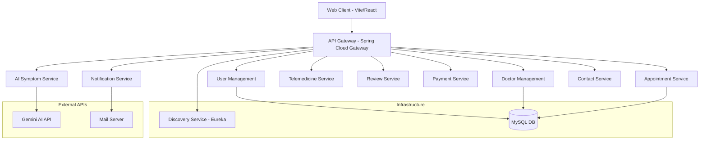

# AI-Powered Hospital Management System

A state-of-the-art, microservices-based Hospital Management System (HMS) featuring AI-driven symptom analysis, real-time doctor management, and seamless patient care integration.


---

## 🌟 Key Features

-   **🤖 AI Symptom Analyzer**: Integrated Gemini AI for preliminary symptom assessment and advice.
-   **👨‍⚕️ Doctor Management**: Real-time management of doctor specializations, availability, and profiles.
-   **📅 Appointment Scheduling**: Seamless booking and tracking of patient appointments.
-   **🎥 Telemedicine**: Integrated virtual consultation capabilities.
-   **👤 User Management**: Secure authentication and role-based access control.
-   **💳 Payment Integration**: Automated billing and payment processing.
-   **📧 Notifications**: Automated email and SMS alerts for appointments and updates.
-   **💬 Patient Reviews**: Feedback system for services and doctors.
-   **📞 Contact Support**: Integrated support ticket management.

---

## 🏗️ Architecture Overview

The system is built using a decentralized microservices architecture managed by a central API Gateway and Service Discovery.



---

## 🚀 Tech Stack

-   **Frontend**: Vite, React, Tailwind CSS
-   **Backend**: Spring Boot 3, Spring Cloud Gateway, Eureka Server
-   **Database**: MySQL 8.0
-   **AI Engine**: Google Gemini API
-   **Infrastructure**: Docker, Docker Compose, Kubernetes
-   **Build Tool**: Maven

---

## 🛠️ Deployment Guide

### 1. Prerequisites
-   **Java 17+**
-   **Node.js & npm** (v18+)
-   **Docker & Docker Compose**
-   **MySQL Server** (if running locally without Docker)
-   **Gemini API Key** (for AI features)

### 2. Configuration
Before starting, set up your Gemini API key in the environment:
```bash
export GEMINI_API_KEY='your_api_key_here'
```
*(On Windows PowerShell: `$env:GEMINI_API_KEY='your_api_key_here'`)*

### 3. Local Deployment (Maven)
Run services individually or using a script:
1.  **Start Eureka**: `infrastructure/discovery-service/mvnw spring-boot:run`
2.  **Start API Gateway**: `infrastructure/api-gateway/mvnw spring-boot:run`
3.  **Start Microservices**: Navigate to each folder in `services/` and run `mvnw spring-boot:run`
4.  **Start Frontend**:
    ```bash
    cd web-client
    npm install
    npm run dev
    ```

### 4. Docker Deployment (Recommended)
You can launch the entire ecosystem with a single command:
```bash
docker-compose up -d --build
```
-   **API Gateway**: http://localhost:8099
-   **Service Discovery**: http://localhost:8761
-   **Frontend**: http://localhost:5173

### 5. Kubernetes Deployment
Manifests are available in the `k8s/` directory for orchestration.

#### Full Cluster Setup
1.  **Run Setup Script**:
    ```powershell
    ./k8s/setup-and-run.ps1
    ```
2.  **Port Forwarding (All Services)**:
    ```powershell
    ./k8s/port-forward-all.ps1
    ```

#### Manual Cluster Setup (Alternative)
If you prefer to deploy manually via CLI, run these commands in order:

1.  **Deploy Database & Infrastructure**:
    ```bash
    kubectl apply -f k8s/database.yaml
    kubectl apply -f k8s/hospital-config.yaml
    kubectl apply -f k8s/api-gateway-config.yaml
    ```
2.  **Deploy Microservices**:
    ```bash
    kubectl apply -f k8s/web-client.yaml
    kubectl apply -f k8s/services/core-backend-services.yaml
    kubectl apply -f k8s/services/other-backend-services.yaml
    kubectl apply -f k8s/services/support-backend-services.yaml
    ```
3.  **Verify Deployment**:
    ```bash
    kubectl get pods
    kubectl get svc
    ```

#### Individual Service Deployment & Access
If you prefer to manage services separately, use the following commands:

| Service | Local (Maven) | K8s Port-Forward | Port (Local) |
| :--- | :--- | :--- | :--- |
| **Discovery Service** | `cd infrastructure/discovery-service; ./mvnw spring-boot:run` | `kubectl port-forward svc/discovery-service 8761:8761` | 8761 |
| **API Gateway** | `cd infrastructure/api-gateway; ./mvnw spring-boot:run` | `kubectl port-forward svc/api-gateway 30099:8099` | 8099 |
| **User Management** | `cd services/user-management; ./mvnw spring-boot:run` | `kubectl port-forward svc/user-management 8081:8081` | 8081 |
| **Doctor Management** | `cd services/doctor-management; ./mvnw spring-boot:run` | `kubectl port-forward svc/doctor-management 8082:8082` | 8082 |
| **Appointment Service** | `cd services/appointment-service; ./mvnw spring-boot:run` | `kubectl port-forward svc/appointment-service 8083:8083` | 8083 |
| **AI Symptom Service** | `cd services/ai-symptom-service; ./mvnw spring-boot:run` | `kubectl port-forward svc/ai-symptom-service 8089:8089` | 8089 |
| **Notification Service** | `cd services/notification-service; ./mvnw spring-boot:run` | `kubectl port-forward svc/notification-service 8085:8085` | 8085 |
| **Telemedicine Service** | `cd services/telemedicine-service; ./mvnw spring-boot:run` | `kubectl port-forward svc/telemedicine-service 8084:8084` | 8088 |
| **Review Service** | `cd services/review-service; ./mvnw spring-boot:run` | `kubectl port-forward svc/review-service 8088:8088` | 8086 |
| **Contact Support** | `cd services/contact-service; ./mvnw spring-boot:run` | `kubectl port-forward svc/contact-service 8087:8087` | 8087 |
| **Payment Service** | `cd services/payment-service; ./mvnw spring-boot:run` | `kubectl port-forward svc/payment-service 8086:8086` | 8084 |
| **Web Client** | `cd web-client; npm run dev` | `kubectl port-forward svc/web-client 30173:80` | 5173 |

---

## 📄 Deliverables Summary

1.  **Core Microservices**: 9 production-ready services for hospital operations.
2.  **AI Engine**: `ai-symptom-service` leveraging Google's Gemini models.
3.  **Infrastructure**: Eureka Server for discovery and Spring Cloud Gateway for routing.
4.  **Frontend**: High-performance React application built with Vite.
5.  **Deployment Scripts**: Docker Compose and K8s manifests for automated scaling.

---

## 📝 Contact & Support
For any issues regarding form submissions or connectivity, please check the logs via `docker logs <container-name>`.


